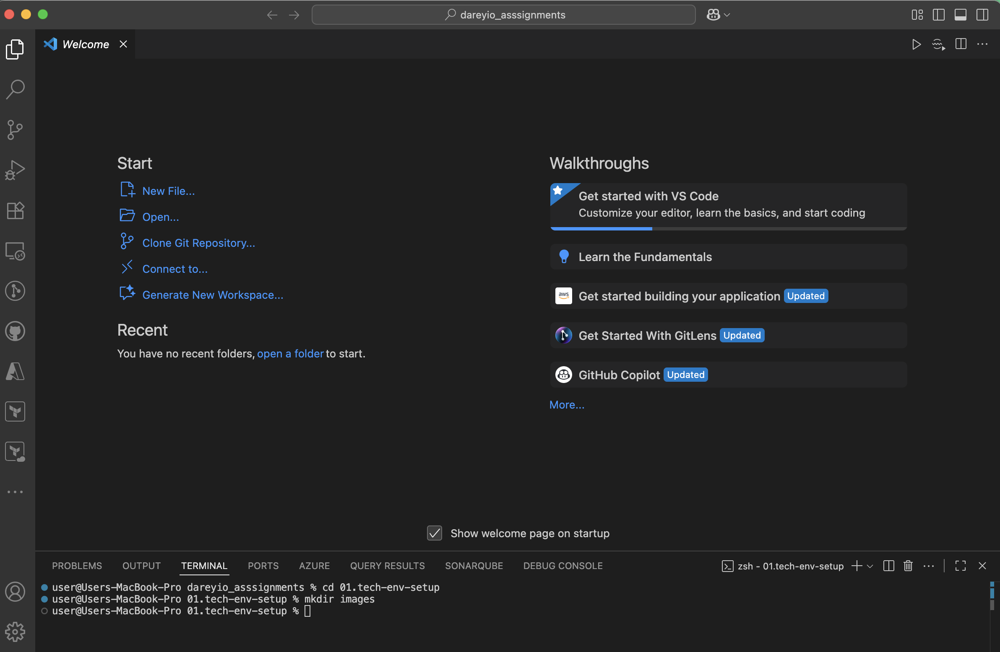
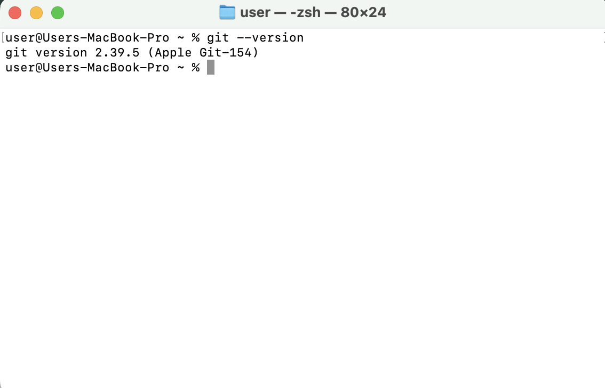
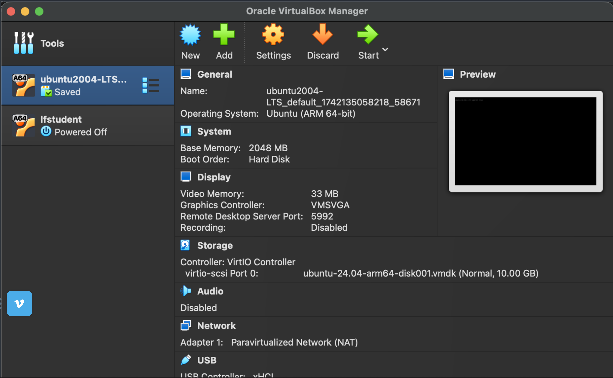
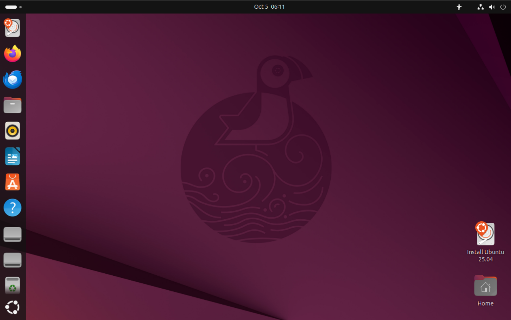
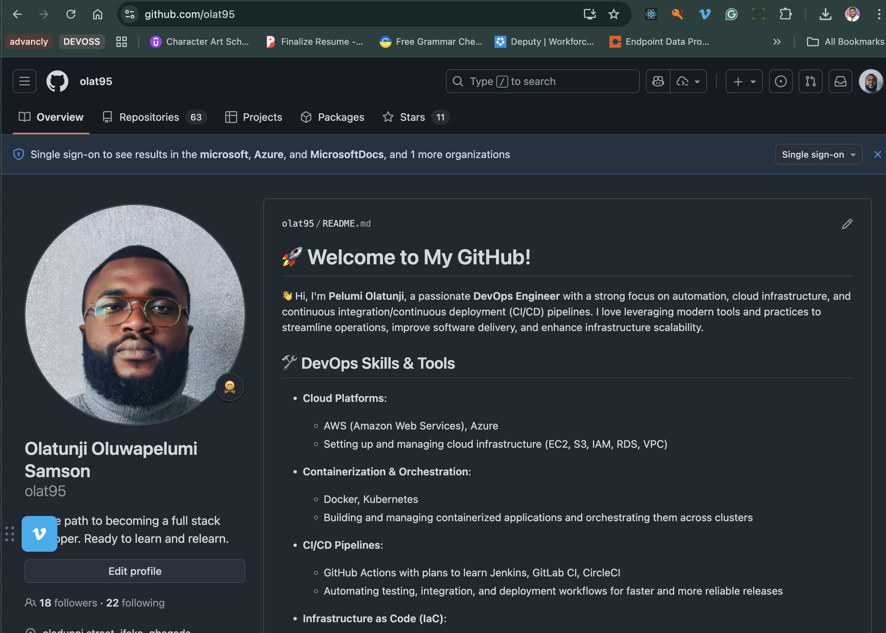
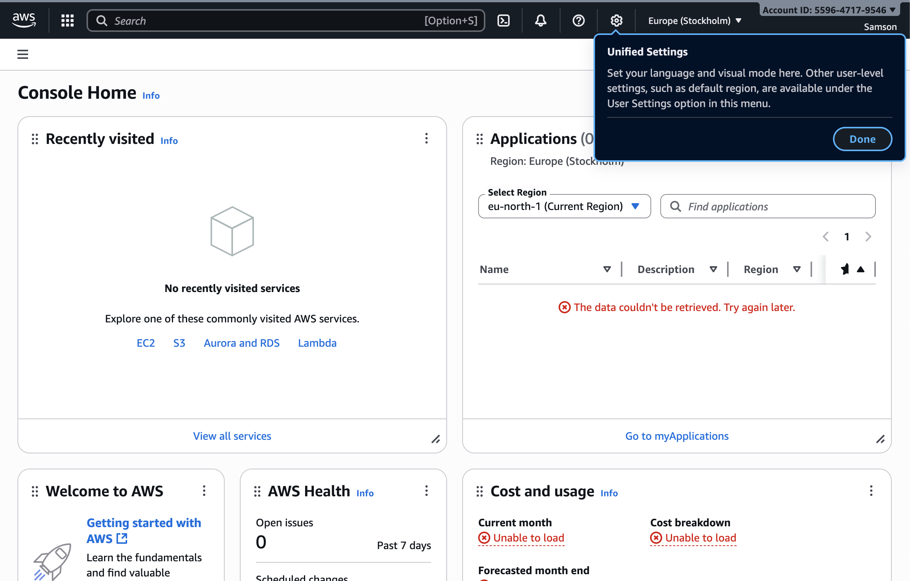

# Tech Environment Setup

This document shows essential tools and accounts required to set up environment for darey.io DevOps projects.

## Table of Contents

1. [VS Code Installed](#01-vs-code-installed)
2. [Git Installed](#02-git-installed)
3. [VirtualBox running on MacOs](#03-virtualbox-running-on-macos)
4. [Ubuntu VM running on VirtualBox](#04-ubuntu-vm-running-on-virtualbox)
5. [Github Account](#05-github-account)
6. [AWS Account](#06-aws-account)

---

## 01. VS Code Installed

## 02. Git Installed

## 03. VirtualBox running on MacOs

## 04. Ubuntu VM running on VirtualBox

## 05. Github Account

My github page can be accessed [here](https://github.com/olat95)

## 06 AWS Account

