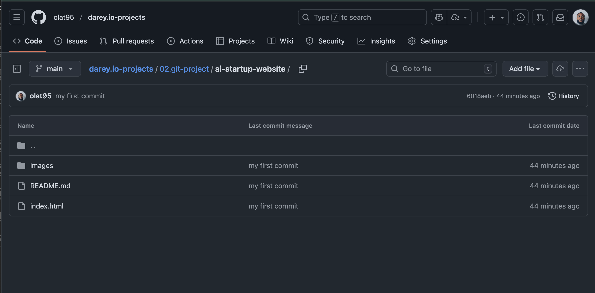

# AI Startup Website – Git Workflow Guide

Welcome to the `ai-startup-website` project! This guide provides a comprehensive, step-by-step workflow for collaborating on this repository using Git and GitHub. It covers everything from initial setup to advanced branching, merging, and pull request management, with annotated screenshots for clarity.

---

## Table of Contents

1. [Project Overview](#project-overview)
2. [Project Structure](#project-structure)
3. [Prerequisites](#prerequisites)
4. [User Credentials Setup](#user-credentials-setup)
5. [Repository Cloning](#repository-cloning)
6. [Initial Commit](#initial-commit)
7. [Branching and Feature Development](#branching-and-feature-development)
8. [Feature Updates](#feature-updates)
9. [Viewing Branches on GitHub](#viewing-branches-on-github)
10. [Creating Pull Requests](#creating-pull-requests)
11. [Pulling Changes](#pulling-changes)
12. [Merging Branches](#merging-branches)
13. [Pull Requests from Other Branches](#pull-requests-from-other-branches)

---

## Project Overview

This repository contains the source code and assets for an AI startup's website. The workflow described here ensures that all contributors follow best practices for version control, collaboration, and code review.

---

## Project Structure

The repository is organized as follows:

```
ai-startup-website/
├── index.html
├── README.md
└── images/
    ├── 01.credentials-setup.png
    ├── 02.repo-clone.png
    ├── 03.initial-commit.png
    ├── 04.branch-creation.png
    ├── 05.feature-update.png
    ├── 06.Github-page.png
    ├── 07.create-pr.png
    ├── 08.git-pull.png
    ├── 09.merging-branches.png
    └── 10.pull-request.png
```

---

## Prerequisites

- [Git](https://git-scm.com/) installed on your machine
- A [GitHub](https://github.com/) account with access to the repository
- Basic familiarity with the command line

---

## User Credentials Setup

Before making any commits, configure your Git user credentials to ensure your contributions are properly attributed.

```bash
git config --global user.name "Your Name"
git config --global user.email "your.email@example.com"
```

**Screenshot:**  


---

## Repository Cloning

Clone the repository from GitHub to your local machine:

```bash
mkdir git-project
cd git-project
git clone https://github.com/MMuyideen/ai-startup-website.git
cd ai-startup-website
```

**Screenshot:**  


---

## Initial Commit

After making your first changes (e.g., editing `index.html`), stage and commit them:

```bash
git status
git add index.html
git status
git commit -m "This is my first commit"
git push origin main
```

**Screenshot:**  


---

## Branching and Feature Development

Always create a new branch for each feature or bugfix. This keeps the main branch stable and makes collaboration easier.

```bash
git branch                # List all branches
git checkout -b update-navigation  # Create and switch to a new branch
git add index.html
git commit -m "Update navigation bar"
git push origin update-navigation
```

**Screenshot:**  


---

## Feature Updates

To work on a new feature, switch to the main branch, pull the latest changes, and create a new branch:

```bash
git checkout main
git pull origin main
git checkout -b add-contact-info
git add index.html
git commit -m "Add contact information"
git push origin add-contact-info
```

**Screenshot:**  


---

## Viewing Branches on GitHub

You can view all branches and their statuses directly on the GitHub repository page.



---

## Creating Pull Requests

After pushing your feature branch, open a Pull Request (PR) on GitHub to propose your changes for review and merging.


---

## Pulling Changes

To keep your branch up to date with the latest changes from `main` or another branch:

```bash
git checkout your-feature-branch
git pull origin main
```


---

## Merging Branches

Once your PR is approved, merge your feature branch into `main` (or the target branch) via GitHub or the command line.


---

## Pull Requests from Other Branches

You can also create pull requests from one feature branch to another, facilitating code review and integration.


---

## Best Practices

- Commit frequently with clear, descriptive messages.
- Always work on a separate branch for each feature or fix.
- Pull the latest changes before starting new work.
- Use Pull Requests for all merges to ensure code review.
- Keep your branches up to date with `main` to avoid conflicts.

---
