# Linux Fundamentals

## Creating and connecting to AWS EC2 Instance (Linux Server)

#### In this project, I will be creating a linux server, ssh into it, and execute basic Linux commands on the Linux server

### The tools used for this project include:

- AWS account
- Terminal
- GitHub

## Sign in to AWS

Navigate to AWS console and signin to your account

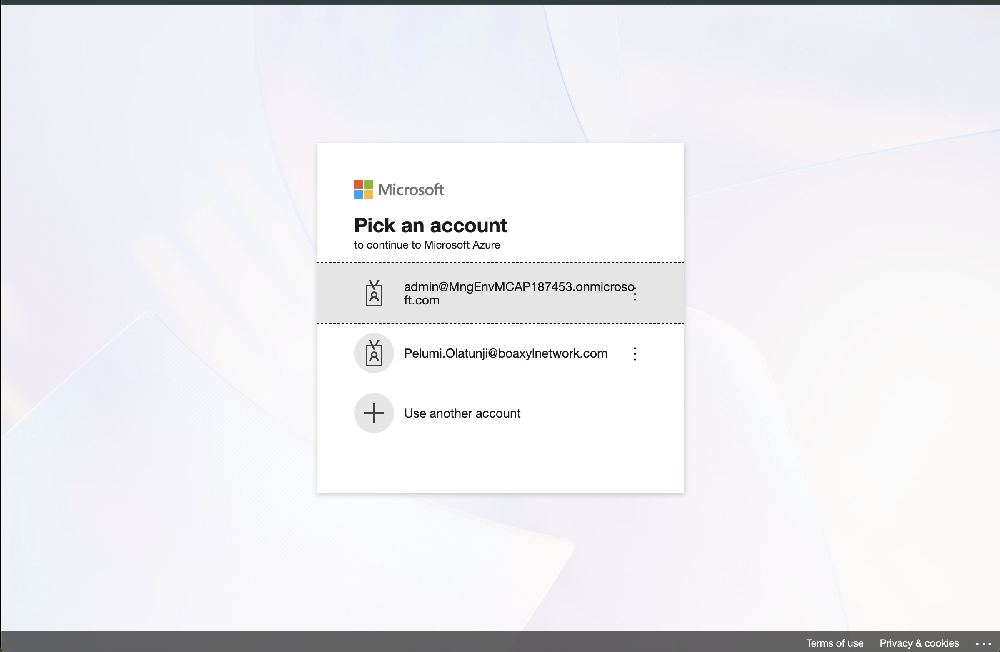

After Successful sigin

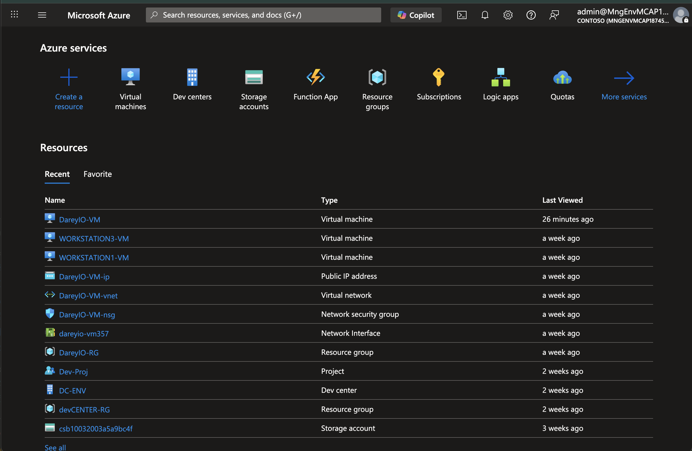

## Create EC2 Instance

In the conole search bar, find Elastic Cloud Compute `EC2`

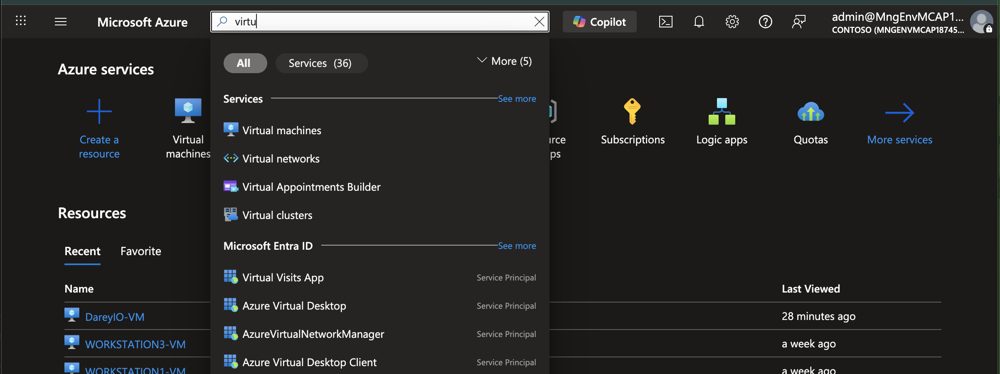

## Launch EC2 Instance

Click Launch instance from the top right of the page
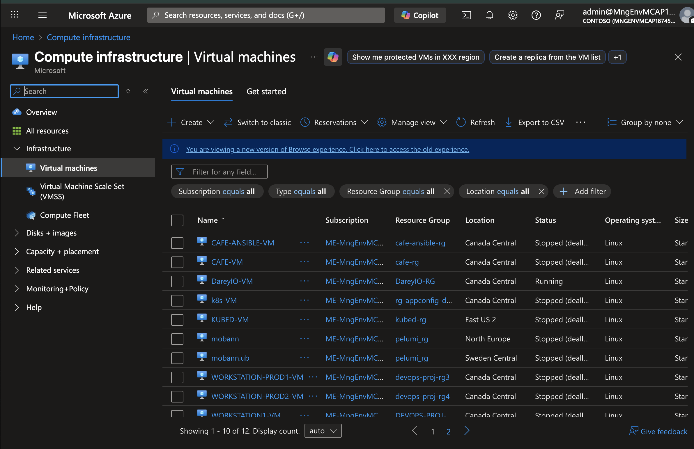

Fill in the required details to create Ec2 instance

- name: `Linux-Server`
- Amazon Machine Image (AMI): `Ubuntu Server 24.04 LTS (HVM)`
- Instance type: `t3.micro` (free tier eligible)
- Create a ne key pair and name it.
- Download the PEM key
- Leave network settings as Default
- Storage: `15gb gp3`
- Click Launch instance by the right side of the page

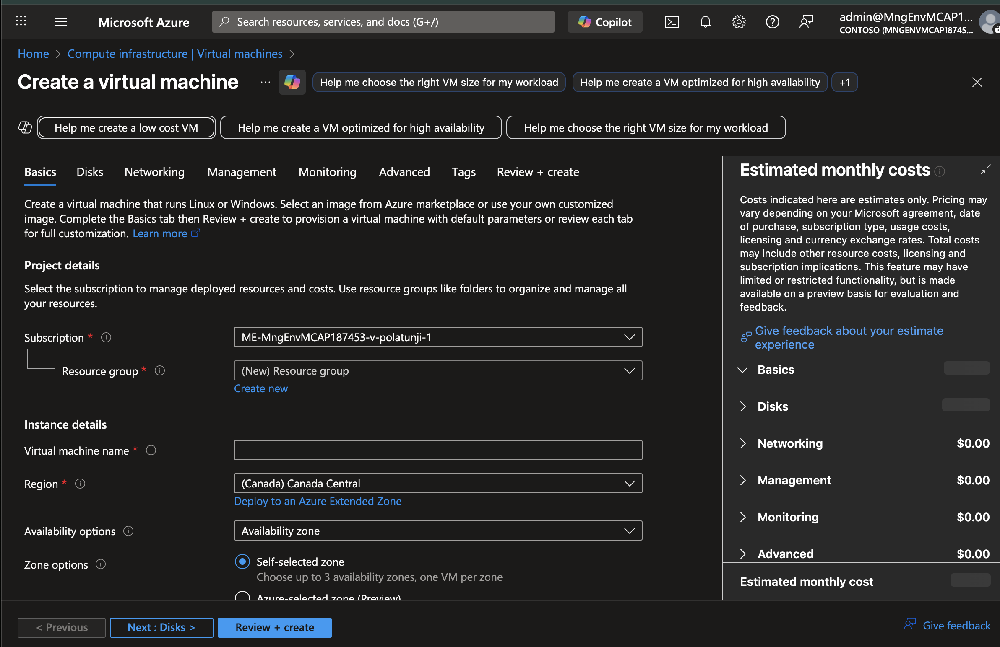

Instance created Successfully

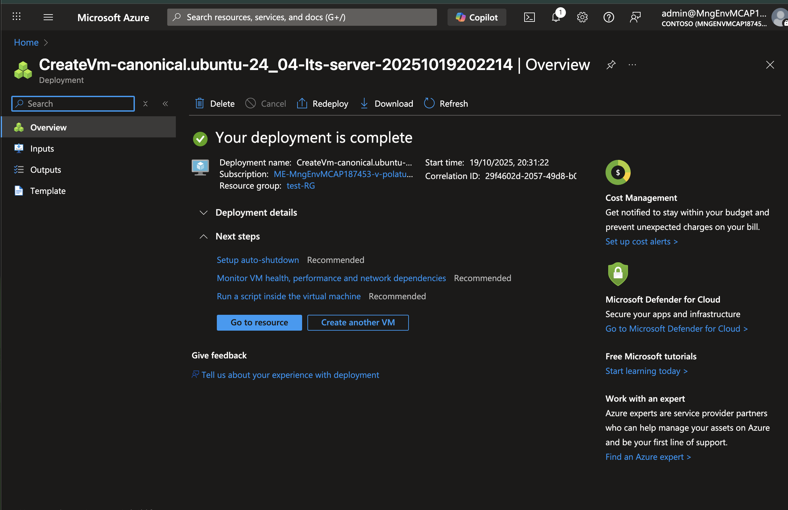

## Connect to the server

Connect to the Server following the steps below (Mac Os)

- Open Terminal
- run `cd Downloads` (where the PEM key was downloaded)
- run `chmod 400 "key.pem"` to grant the correct permission to the file
- run the command `ssh -i "<keyname>.pem" <username>@<ec2 DNS name>` || `ssh -i "key.pem" ubuntu@ec2-18-222-112-112.us-east-2.compute.amazonaws.com`

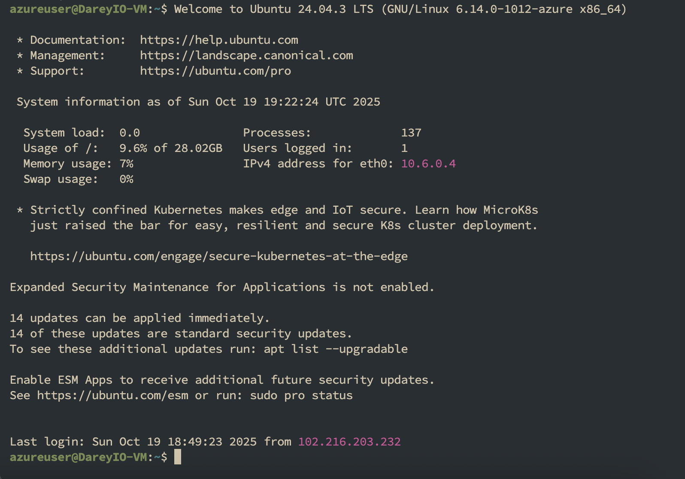

## Update Package List

run `sudo apt update`

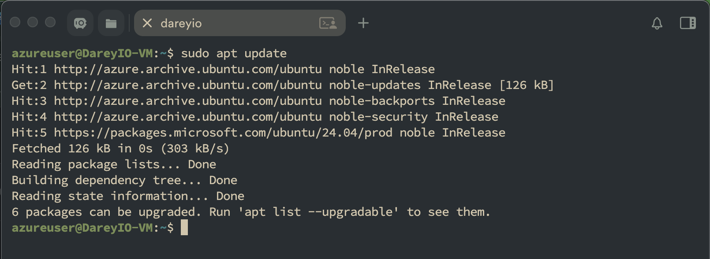

## Install `tree` Application

run `sudo apt install tree`

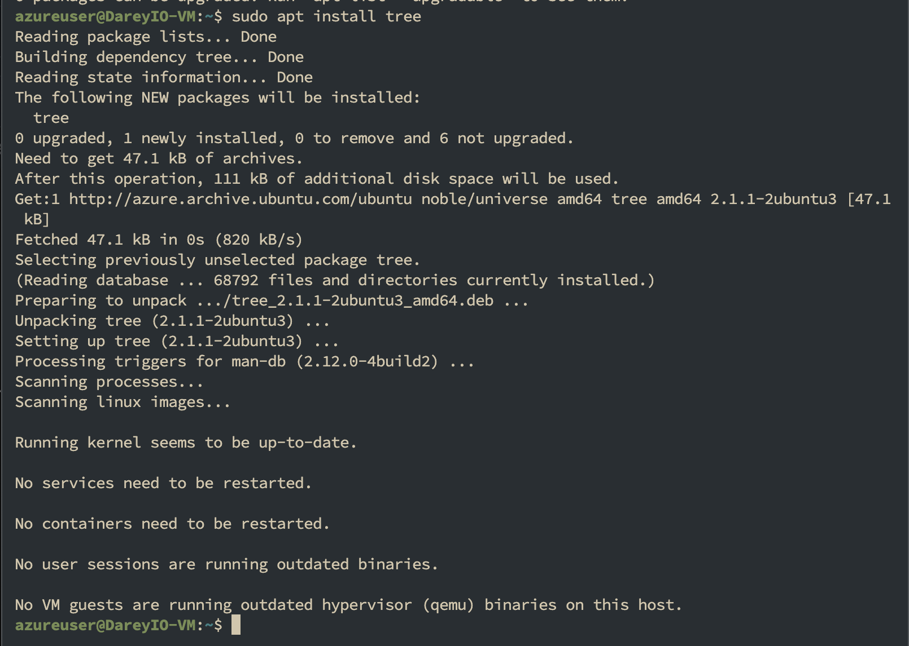

## Run tree commands

syntax: `tree <directory>`

run `tree ~/Downloads`

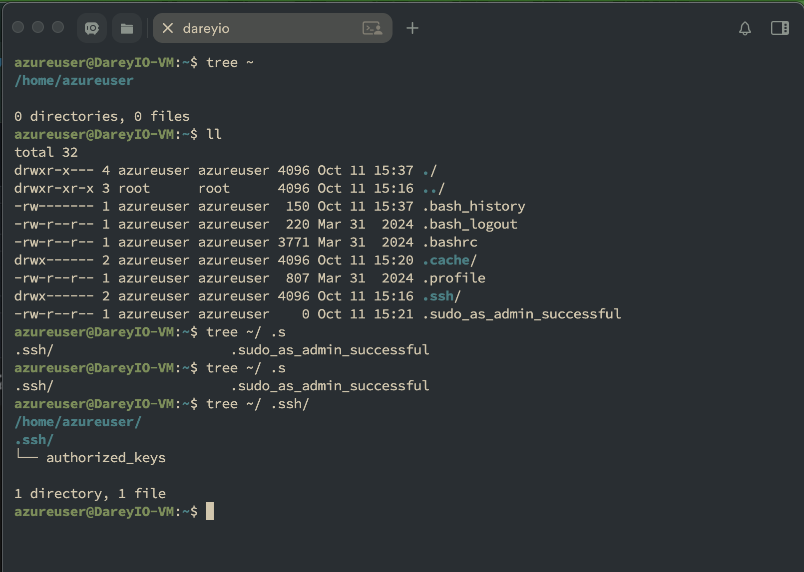

## Updating Applications

run `sudo apt upgrade` to update installled packages

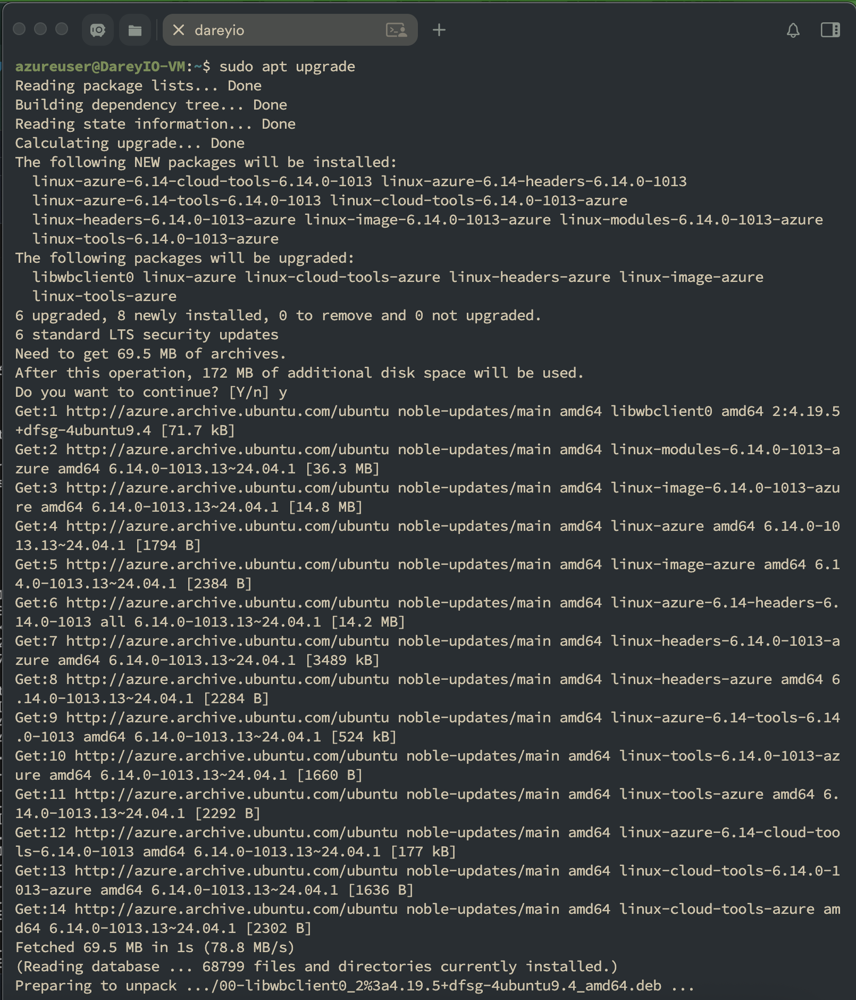

## Uninstall Tree Application

run `sudo apt remove tree` to update installled packages

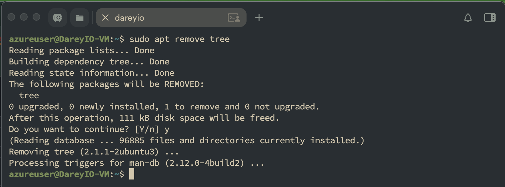

### The above implementation details the steps for setting up and managing a Linux instance on AWS, including how to connect to it and perform basic Linux operations.
