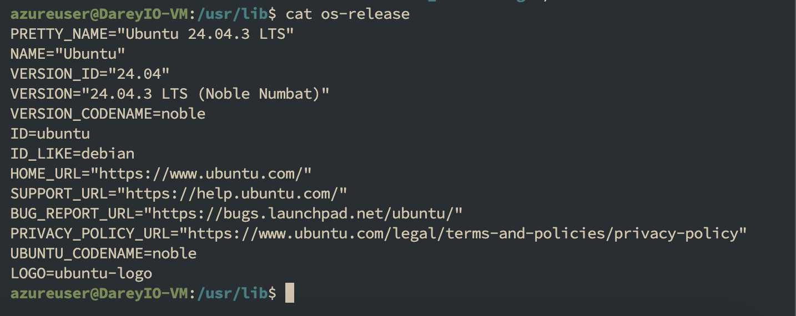
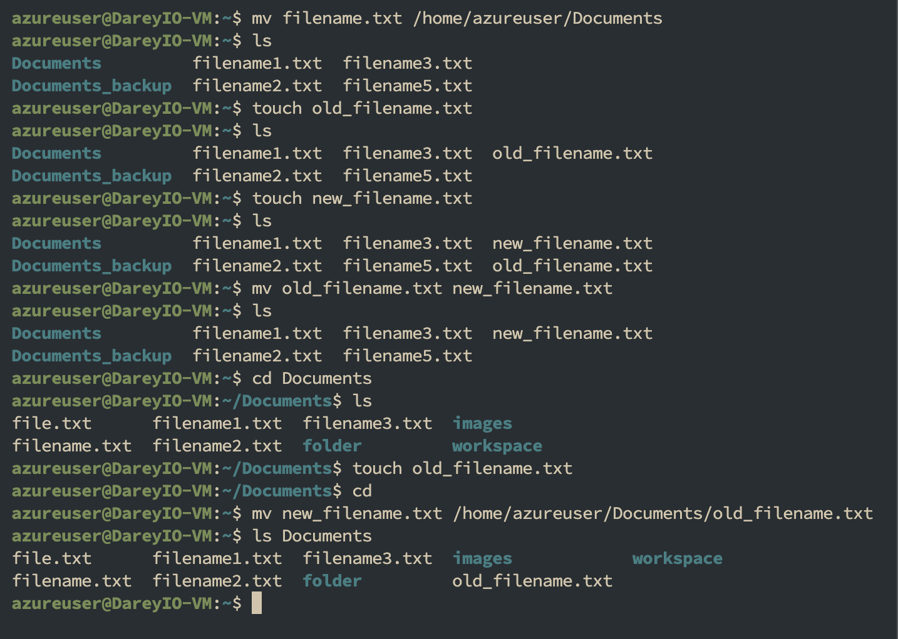

# Basic Linux Commands

## Linux Commands Deep Dive

#### In this project, I will be playing around the Linux environment for Navigation & file manipulation

### The tools used for this project include:

- AWS EC2 or Ubuntu running on VirtualBox
- Terminal
- GitHub

## SUDO

Sudo is used to perform actions with elavated permissions
Try creating a folder in root folder by running `mkdir /root/example`

You get an a permission denied error as shown above.

Now run the the command again with Sudo. (it may request you input your passsword)

## LS

ls is used to list files

verify the Folder's creation by running `sudo ls /root`

## PWD

Run `pwd` to find the path of the current working directory

## CD

Use `cd` command to change directory.

Run `cd /` to change to root directory. notice the tilde `~` before the dollar `$` sign change to `/`

now we list the files and folders in the root directory by running `ls -l`

## Side Hustle Task 1

- Navigate to the usr directory `cd /usr`
- Create a directory named photos in the usr directory `mkdir photos`
- Create 3 more directories in the photos directory with a single command`mkdir photos/images photos/picture photos/screenshots`
- show the directories in the terminal `ls` & `ls photos/`
- Navigate into one of the child ddirectories `cd photos/images/`
- show the full path `pwd`

## ls command

Playing around with some options to modify the results of the ls command

`ls /home/ubuntu/Documents` - Lists the files and Folders in the directory
`ls -R /home/ubuntu/Documents` - Lists all the files in the subdirectories
`ls -a /home/ubuntu/Documents` - Shows both hidden and visible files
`ls -lh /home/ubuntu/Documents` - Show the file sizes in easily readable formats such as KB,MB, GB and TB

## Cat Command

cat command is used to list, combine and write file content to Standard output

run `sudo cat /etc/os-release` to display the content of the os-release file

## CP command

The cp command is used to copy files or directories including their content o another location

- Copy files from one directory to another - `cp filename.txt /home/ubuntu/Documents`
- Copy multiple files to a different anothe directory - `cp filename1.txt filename2.txt filename3.txt /home/username/Documents`
- Copy the contents of a file to a new file in the same directory - `cp filename1.txt filename2.txt`
- Copy an entire directory by passing the R flag - `cp -R /home/username/Documents /home/username/Documents_backup`

## Mv Command

The mv command is used to move files or directories including their content to another location or rename files

- mv file from one directory to another - `mv filename1.txt /home/ubuntu/Documents`
- Rename a file in the same directory - `nv old_filename.txt new_filename.txt`
- Rename a file while moving to a different directory - `mv new_filename.txt /home/ubuntu/Documents/old_filename.txt`

## Rm Command

The rm command is used to delete a file and directory as well

- Delete a file - `rm filename.txt`
- Delete multiple files at once - `rm filename1.txt filename2.txt filename3.txt`

## touch Command

The touch command is used to create empty file

`touch file.txt`

## find

The find command is used to earch files in a specific directory

Find the `file.txt` file using the name from the Documents folder `find Documents/ -name file.txt`

