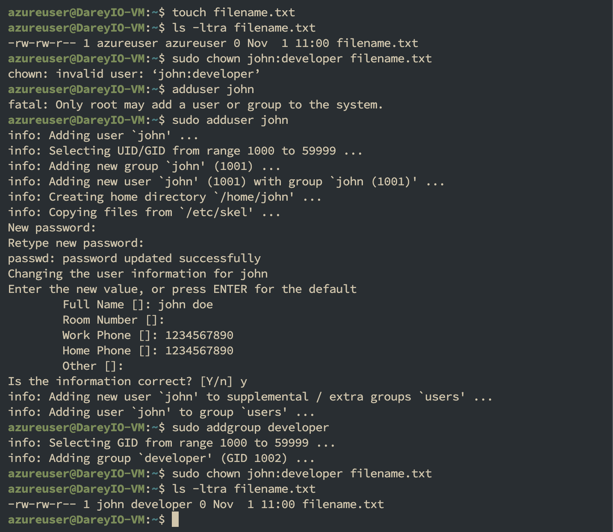
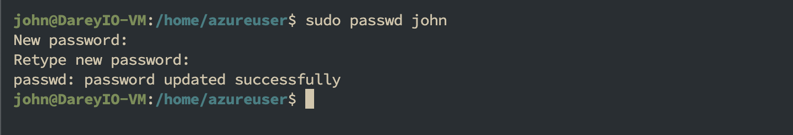

# Advanced Linux Commands

## File Permissions and Access Rights

## Understanding File permissions

Run command `ls -latr`


Let's break it down to understand what each part means:

- In the output above, you will notice that some of the first character can be a - or d: d means it's a directory, - means it's a file.
- The next three characters (rwx) show the permissions for the owner. r stands for read, w for write, and x for execute.
- If a permission is not granted, you'll see a - in its place (e.g., r-x means read and execute permissions are granted, but write permission is not).
- The hyphen separates, owner, group, and others
- The following three characters after the owner's permissions represent the group's permissions, using the same r, w, and x notation.
- The last three characters show the permissions for others.

The order the user class is represented is as follow;

- The first hyphen "-"is the user
- The second hyphen "-" is the group
- The third hyphen "-" is others

## File Permission Commands

To manage file permissions and ownership, Linux provides several commands:

### chmod command

The `chmod` command allows you to modify file permissions. You can use both symbolic and numeric representations to assign permissions to the user, group, and others.
Lets see an example.

- Create an emply file using the `touch` command - `touch script.sh`
- Check the permission of the file - `ls -latr script.sh`


Now lets update the permission so that all the user classes will have execute permission - `chmod +x script.sh`

The above command uses the chmod command with the `+x` option to grant execute permission to the file `script.sh`. The `+x` option adds the execute permission to the existing permissions for all the user classes.

Now lets check what the file permissions look like


The same command can be executed to achieve the same result using the numbers approach - `chmod 755 script.sh`

To add execute permissions for all (user, group, others), you would add 1 to each of the three categories, resulting in 755:

- (4+2+1) = 7 for the user (read, write, and execute),
- (4+1) = 5 for the group (read and execute),
- (4+1) = 5 for others (read and execute).

Lets consider another example. Imagine the owner of a file is currently the only one with full permissions to 'note. txt'

To allow group members and others to read, write, and execute the file, change it to the `-rwxrwxrwx` permission type, whose numeric value is 777: `chmod 777 note.txt`

Check the new permissions - `ls -latr note.txt`


Now, notice the dash `-` in the first position represents the file type and not a user class. It indicates that the entry is a regular file.

## chown command

The chown command allows you to change the ownership of files, directories, or symbolic links to a specified username or group.

Here's the basic format - `chown [option] owner[:group] file(s)`

For example, lets assume there is a user on the server called "john", a group on the server called "developers" and you want the owner of `filename.txt` changed from "dare" to "john", and to also ensure that any user in the developer group has ownership of the file as well:

The command would look like - `chown john:developer filename.txt`

Check the output with `ls -latr` command on this file to then see the new changes.



## Superuser Privilledges

It is often necessary to become the superuser to perform important tasks in linux, but as we know, we should not stay logged in as the superuser. In most linux distributions, there is a command that can give you temporary access to the superuser's privileges. This program is called `sudo` (short for super user) and can be used in those cases when you need to be the superuser for a small number of tasks. To use the superuser privilledes, simply type `sudo` before the command you will be invoking

To switch to the root user, simply run `sudo -i`

You can type `exit` to leave the shell


## User Management on Linux

As a DevOps engineer, you are also going to be doing systems administration which involves managing different users on the servers. You should know how to create a new user, or group, modify their permissions, update password and such similar tasks.

### Creating a User

To create a new user on Ubuntu Server, you can use the `adduser` command. Assuming the name of the user to be created is joe. Open the terminal and run the following command - `sudo adduser johndoe`


running this command will prompt you to enter and confirm a password for the new user. You will also be asked to provide some additional information about the user, such as their full name and contact information. Once you provide the necessary details, the user account will be created, and a home directory will be automatically generated for the user.

The home directory represents a file system directory created in the name of the user. Such as `/home/johndoe` This is where each user created on the server will store their respective data.

### Granting Administrative Privileges

By default, newly created user accounts do not have administrative privileges. To grant administrative access to a user, you can add the user to the sudo group.

Users in the sudo group can run commands with administrative privileges. To the johndoe user to the sudo group, run - `sudo usermod -aG sudo johndoe`

additionally run `groups username` to see the groups a user bleong to

running `groups johndoe` shows that the user is now part of the sudo group


`usermod` - This is a command that modifies user account properties.

- aG: These are flags used with the usermod command.
- a stands for "append" and is used to add the user to the specified group(s) without removing them from other groups they may already belong to.
- G stands for "supplementary groups" and is followed by a comma-separated list of groups. It specifies the groups to which the user should be added or modified.

In the given command, `-aG sudo` is used to add the user `johndoe` to the sudo group.

The sudo group is typically associated with administrative or superuser privileges. By adding `johndoe` to the `sudo` group, the user gains the ability to execute commands with elevated privileges.

## Switching User Accounts

To start using the system as another user, you will need to use the `su` command to switch.

To switch to another user account, use the `su` command followed by the username. For example, to switch to the johndoe account, run - `su johndoe`

You will be prompted to enter the password for the user. Once authenticated, you will switch to the user's environment.


when you switch user, you will be in the directory of the previous user. You can run the command `cd /home/johndoe` to go to the home directory of the new user

## Modifying User Accounts

### changing User Password

To change the password for a user, use the `passwd` command followed by the username. For example, to change the password for johndoe, run - `sudo passwd johndoe`

You will be prompted to enter old, new and confirm the new password for the user.



### Creating a Group

To create a new group, use the `groupadd` command. For example, to create a group named `developers` - `sudo groupadd developers`

### Adding Users to the Group

Use the `usermod` command to add users to the group. For instance, to add users "john" and "jane" to the "developers" group - `sudo usermod -aG developers johndoe`

The `-aG` options append the "developers" group to the users' existing group memberships.

### Verifying Group Memberships

To confirm the group memberships for a specific user, use the `id` command. For example, to check the group memberships for the user "johndoe" - `id johndoe`


### Deleting a User

To delete a user, run the command below - `sudo userdel username`

### Ensuring Proper Group Permissions

Groups in Linux are often used to manage permissions for files and directories. Ensure that the relevant files or directories have the appropriate group ownership and permissions.

For example, to grant the `developers` group ownership of a directory - `sudo chown :developers /path/to/directory`

And to grant read and write permissions to the group - `sudo chmod g+rw /path/to/directory`

## Side Hustle

- Create a group on the server and name it `devops` - `sudo groupadd devops`
- Create 5 users [`mary`, `mohammed`, `ravi`, `tunji`, `sofia` ] and ensure each user belong to the devops group

```bash
sudo useradd -m -G devops mary
sudo useradd -m -G devops mohammed
sudo useradd -m -G devops ravi
sudo useradd -m -G devops tunji
sudo useradd -m -G devops sofia
```

- create a folder for each user in the `/home` directory. For example `/home/mary` - run `ls /home` to verify each user's folder
- Ensure that the group ownership of each created folder belongs to `devops`

```bash
sudo chown :devops /home/mary
sudo chown :devops /home/mohammed
sudo chown :devops /home/ravi
sudo chown :devops /home/tunji
sudo chown :devops /home/sofia
```

- run `ls -ld /home/*` to verify group ownership


## Conclusion

This guide covered essential Linux file permissions and user-management commands you will use frequently as a DevOps engineer: ls, chmod, chown, sudo, adduser/usermod, groupadd and related commands.
