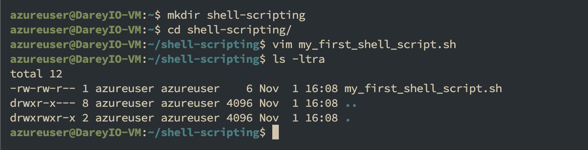
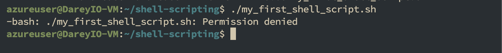
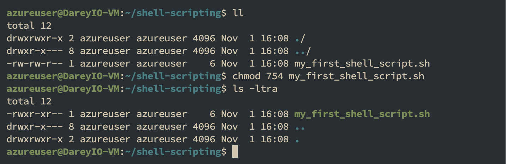
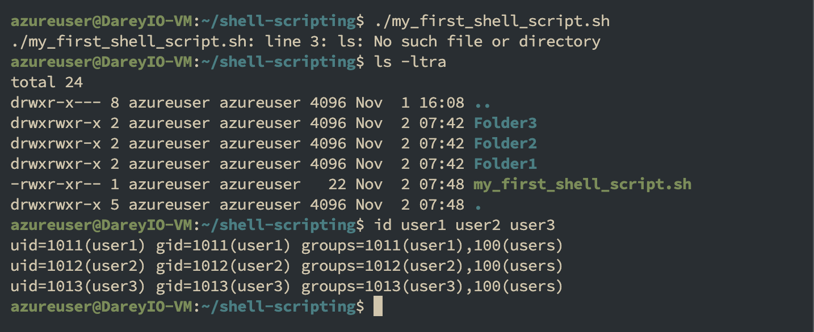
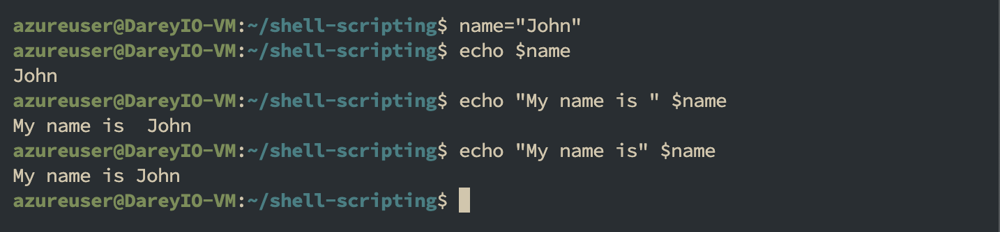

# Linux Shell Scripting (Mini)

### What Is a Shebang (#!/bin/bash) ?

Notice that, at the beginning of the shell script we use below, we have `#!/bin/bash` written there. This is what is called a `shebang`, It is a special notation used in Unix-like operating systems like Linux, to specify the interpreter that should be used to execute the script. In this case, `#!/bin/bash` specifically indicates that the Bash shell should be used to interpret and execute the script.

You can explore the `/bin` folder and see the different programs in there. bash is one of them which is used as the interpreter in that script. If we wanted to use another shell like `sh`, the shebang would be updated to `#!/bin/sh`

`/bin/bash`: This is the absolute path to the Bash shell executable. It tells the system to use the Bash interpreter located at /bin/bash to run the script.
Without a shebang line, the system may not know how to interpret and execute the script, and you may need to explicitly specify the interpreter when running the script.

## Task 1

1. Create a folder on an ubuntu server and name it `shell-scripting`
2. use cd command to change into the shell-scripting directory
3. Using the vim editor, create a file called `my_first_shell_script.sh`
4. Put the shell script code below into the new file
5. Save the file & exit vim editor
6. Use `ls -latr` command to confirm that the file is indeed created.

You should have something like this:



Something you should notice about the permissions of the newly created file is this `-rw-rw--r--` which means;

1. The owner of the file has read (r) and write (w) permissions.
2. Members of the file's group have read (r) and write (w) permission.
3. Others also have read (r) permission.

However, no one has the execute (x) permission, hence the script cannot be executed.
To execute the script, you would typically do something like this.

```bash
./my_first_shell_script.sh
```

- `./ `This prefix to the file indicates that the command should look for the file in the current directory.
- The dot (.) represents the current directory,
- and the slash (/) is a directory separator

when you hit enter, you should get a response like



Notice that we now have a Permission denied error which can easily be resolved by giving the file the necessary permission it requires.

But, did you also notice the mention of "bash" at the beginning of the error message? It indicates that the error message is coming from the Bash shell itself. Bash is the command interpreter or shell that you're using in the terminal to execute commands. We will talk more about this in the next section.

## Task 2:

1. Add the execute permission for the 'owner' to be able to execute the shell script using command - `chmod 754`
2. run `ls -latr` command to confirm that the owner now has permission to execute the script. `-rwxrw-r--`



2. Run the shell script.
3. Evaluate and ensure that 3 folders are created with `ls` command
4. Evaluate and ensure that 3 users are created on the linux server with the command below

```
id user1 user2 user3
```



# Security Best Practices for File Permissions

- Follow the principle of least privilege: give only the permissions required for the task.
- Avoid chmod 777 — it grants read, write and execute to everyone and can expose files to accidental or malicious modification/execution.
- Prefer tighter defaults. Example:
  - chmod 754 script.sh -> owner = rwx (7), group = r-x (5), others = r-- (4)
  - This allows the owner to modify and run the script while limiting write access by others.
- For sensitive files, prefer 700 (owner-only) or set group ownership and use 750/770 where appropriate.
- Test permission changes in a safe environment before applying to production.

## Variable Declaration and Initialization:

In programming generally, not just shell scripting, variables are essential for creating dynamic and flexible programs.

Variables can store data of various types such as numbers, strings, and arrays. You can assign values to variables using the = operator, and access their values
using the variable name preceded by a `$` sign.

Example: Assigning value to a variable: `name="John"`

From the example above, "John" was asigned to the variable "name".
Now that the variable is assigned, you may ask, how then can i use it?

### Retrieving value from a variable

After assigning a value to a variable, as shown in the previous example where we assigned "John" to the variable name, you can utilize this variable in various wa in your script or program.

One of the most straightforward methods to use or retrieve the value stored in a variable is by echoing it back to the console. This is done using the `echo` command in shell scripting.

Run command `echo $name` to retrieve the value



With these exercises, we have learned some basics of shell scripting like using the Sheband, granting executable permissions, creating and retrieving varibales.
