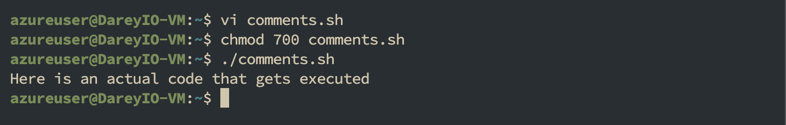

# Linux Shell Scripting (Comments)

## Adding Comments in Bash Scripts

Comments are essential in programming, serving as notes to the programmer and anyone else who might read the code.

They explain what the script or parts of the script do, making the code easier to understand and maintain. This section will guide you on how to add comments in Bash scripts.

### What Are Comments?

Comments are lines in your code that are ignored by the interpreter. In Bash scripts, comments help document the purpose and logic of your code, making it easier for others (and yourself) to follow and understand the script's functionality.

#### Single-Line Comments

Single-line comments in Bash start with the # symbol. Anything following this symbol on the same line is treated as a comment and is not executed.

```
# This is a single-line comment in Bash
echo "Hello, you are learning Bash Scripting on DAREY.IO!" # This is also a comment, following a command
```

#### Using Multiple Single-Line Comments:

```
# This is another way to create
# a multi-line comment. Each line
# is prefixed with a # symbol.
echo "Here is an actual code that gets executed"
```

This approach is straightforward and is commonly used for adding brief descriptions or notes spanning multiple lines.

### Example

- Using the vim editor, create a file called `comments.sh`
- Paste the above code in the file
- Save & exit the editor
- Make the file executable `chmod 700 comments.sh`
- Run the script `./comments.sh`
  

From the image above which shows the output of running the script, you can see only the echo command is executed and the comments are ignored

## Best Practices for Commenting:

• Clarity: Write clear and concise comments that explain the "why" behind the code, not just the "what".

• Maintainability: Keep comments updated as you modify the code to ensure they remain relevant and helpful.

• Usefulness: Comment on complex or non-obvious parts of the script to provide insights into your thought process and decision-making.

• Avoid Overcommenting: Don't comment on every line of code, especially if the code is self-explanatory. Focus on parts that benefit from additional explanation.
