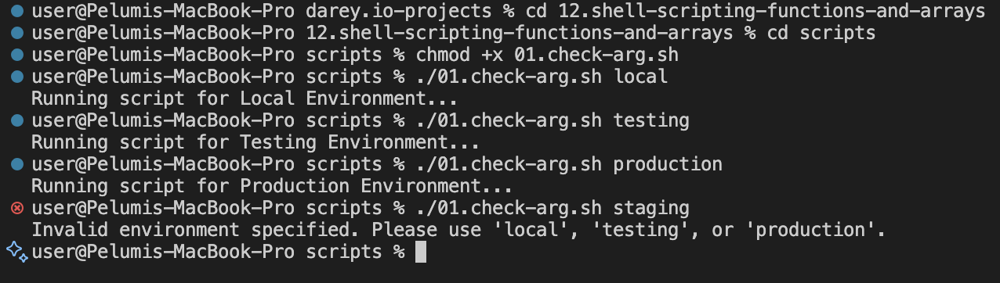
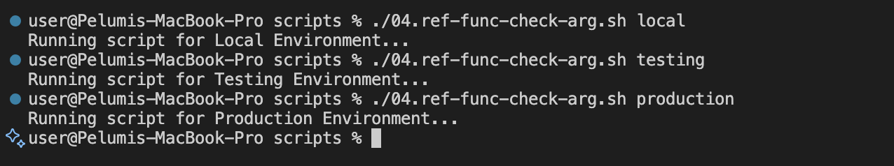
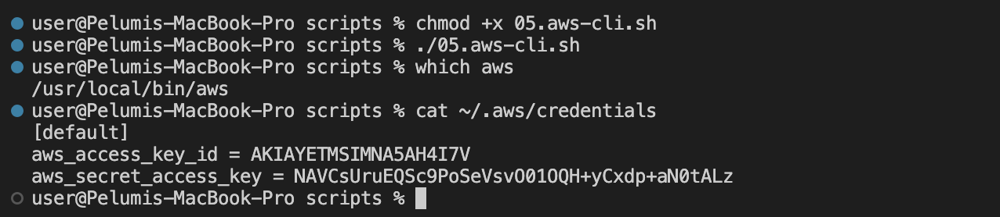
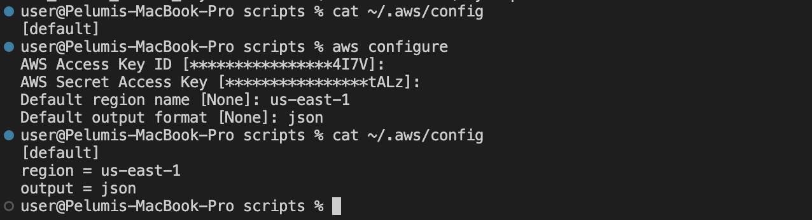

# Mini Project - Working with Functions

## Overview

In this mini-project, we will focus on some other essential concepts in shell scripting.
Remeber the overall goal is to develop a shell script for one of DataWise Solutions's clients, that automates the setup of EC2 instances and S3 buckets. Part of the critical elements we will be focusing on in this project is Functions

## Functions

Organizing your code is key to maintaining clarity and efficiency. One powerful technique for achieving this is through the use of functions.
By encapsulating specific logic within functions, you can streamline your scripts and improve readability. Going forward, you will be creating functions for every piece of requirement you wish to satisfy.

Lets consider the following logic and encapsulate them in functions

1. Check if script has an argument
2. Check if AWS CLI is installed
3. Check if environment variable exists to authenticate to AWS

To create a function in a shell script, you simply have to define it using the following syntax:

```bash
function_name() {"\n    # Function body\n    # You can place any commands or logic here\n"}
```

Here's a breakdown of the syntax:

- **function_name**: This is the name of your function. Choose a descriptive name that reflects the purpose of the function.
- **()**: Parentheses are used to define the function. They can be omitted in simpler cases, but it's good practice to include them for clarity.
- **{}**: Curly braces enclose the body of the function, where you define the commands or logic that the function will execute.

## Practical Examples

### Function: Check if script has an argument

**Without Functions** (Original Code):
Lets take the same code in previous mini-project and encapsulate it in a function.
Here is the code below without a function.

```bash
#!/bin/bash

# Checking the number of arguments
if [ "$#" -ne 0 ]; then
    echo "Usage: $0 <environment>"
    exit 1
fi

# Accessing the first argument
ENVIRONMENT=$1

# Acting based on the argument value
if [ "$ENVIRONMENT" == "local" ]; then
  echo "Running script for Local Environment..."
elif [ "$ENVIRONMENT" == "testing" ]; then
  echo "Running script for Testing Environment..."
elif [ "$ENVIRONMENT" == "production" ]; then
  echo "Running script for Production Environment..."
else
  echo "Invalid environment specified. Please use 'local', 'testing', or 'production'."
  exit 2
fi
```



Here is what it would look like with a function called `check_num_of_args`

```bash
#!/bin/bash

# Environment variables
ENVIRONMENT=$1

check_num_of_args() {
    # Checking the number of arguments
    if [ "$#" -ne 0 ]; then
        echo "Usage: $0 <environment>"
        exit 1
    fi
    }

check_num_of_args()

# Acting based on the argument value
if [ "$ENVIRONMENT" == "local" ]; then
  echo "Running script for Local Environment..."
elif [ "$ENVIRONMENT" == "testing" ]; then
  echo "Running script for Testing Environment..."
elif [ "$ENVIRONMENT" == "production" ]; then
  echo "Running script for Production Environment..."
else
  echo "Invalid environment specified. Please use 'local', 'testing', or 'production'."
  exit 2
fi

```

When a function is defined in a shell script, it remains inactive until it is invoked or called within the script. To execute the code within the function, you must place a call to the function in a relevant part of your script. The below image shows no output when the script is ran

It's crucial to consider the order in which the interpreter evaluates each line of code. Placing the function where it logically fits within the flow of your script ensures that it is available and ready to be executed when needed. This organization helps maintain the readability and coherence of your script, making it easier to understand and debug.

Lets see what that would now look like;

```bash
#!/bin/bash

# Environment variables
ENVIRONMENT=$1

check_num_of_args() {
    # Checking the number of arguments
    if [ "$#" -ne 1 ]; then
        echo "Usage: $0 <environment>"
        exit 1
    fi
    }

check_num_of_args()

# Acting based on the argument value
if [ "$ENVIRONMENT" == "local" ]; then
  echo "Running script for Local Environment..."
elif [ "$ENVIRONMENT" == "testing" ]; then
  echo "Running script for Testing Environment..."
elif [ "$ENVIRONMENT" == "production" ]; then
  echo "Running script for Production Environment..."
else
  echo "Invalid environment specified. Please use 'local', 'testing', or 'production'."
  exit 2
fi

```


With a refactored version of the code, we now have the flow like this;

1. Environment variable moved to the top
2. Function defined
3. Function call
4. Activate based on infrastructure environment section.

What we could also do is encapsulate number 4 in a function and call all the functions at the end of the script. This is what you would see most times in the real world.

Lets see what that would now look like.

```bash
#!/bin/bash

# Environment variables
ENVIRONMENT=$1

# Function to check number of arguments
check_num_of_args() {
    if [ "$#" -ne 1 ]; then
        echo "Usage: $0 <environment>"
        exit 1
    fi
}

# Function to handle environment activation
activate_infra_environment() {
    if [ "$ENVIRONMENT" == "local" ]; then
        echo "Running script for Local Environment..."
    elif [ "$ENVIRONMENT" == "testing" ]; then
        echo "Running script for Testing Environment..."
    elif [ "$ENVIRONMENT" == "production" ]; then
        echo "Running script for Production Environment..."
    else
        echo "Invalid environment specified. Please use 'local', 'testing', or 'production'."
        exit 2
    fi
}

# Call the functions
check_num_of_args "$@"
activate_infra_environment
```

With the updated version of the code, you can now see how clean the code looks. You can easily understand what each function is doing based on its name, comments, and the order in which the functions are called at the end



## Function to Check if AWS CLI is installed

```bash
#!/bin/bash

# Function to check if AWS CLI is installed
check_aws_cli() {
    if ! command -v aws &> /dev/null; then
        echo "AWS CLI is not installed. Please install it before proceeding."
        return 1
    fi
}
```

Lets break down this section of the code;

- if! command -v aws &> /dev/null; then: This line contains an if statement. Here's the breakdown:

  - !: This is the logical negation operator. It reverses the result of a command, so! command means "if Not".
  - command-v aws: This command checks if the aws command is available in the system. It returns the path to the aws executable if it exists, or nothing if it doesn't. if you run `which aws` on your system, it will tell you the path to the 'aws' cli that you installed previously

- Hence, the "command -v" utility also returns the same thing that the "which" command returns. With the "!" operator, we are saying that if the path for "aws" does not exist, then return 1

  - &> /dev/null: This part redirects both standard output (stdout) and standard error (stderr) to /dev/null, a special device file that discards all output. This effectively suppresses any output from the command -v command. Watch this video t

  - then: This keyword indicates the beginning of the code block to execute if the condition in the if statement is true.

  - echo "AWS CLI is not installed. Please install it before proceeding.": This line prints an error message to the standard output if the AWS CLI is not installed.

- return 1: This line causes the function to exit with a non-zero exit status (1). A non-zero exit status conventionally indicates an error condition in Unix-like systems.


---

### Check if environment variable exists to authenticate to AWS

To programmatically create resources in AWS, you need to configure authentication using various means such as environment variables, configuration files, or IAM roles.

The `~/.aws/credentials` and `~/.aws/config` files are commonly used to store AWS credentials and configuration settings, respectively.

Running the `aws configure` command you ran earlier creates these files. You can use the cat command to open them and see the content.

**Credentials File (~/.aws/credentials)**
The credentials file typically contains AWS access key ID and secret access key pairs. You will have only default section at first. But you can add other environments as required. Just as we have for testing and production below.
It is formatted as follows:

```bash
[default]
aws_access_key_id = YOUR_ACCESS_KEY_ID
aws_secret_access_key = YOUR_SECRET_ACCESS_KEY

[profile testing]
aws_access_key_id = YOUR_TESTING_ENVIRONMENT_ACCESS_KEY_ID
aws_secret_access_key = YOUR_TESTING_ENVIRONMENT_SECRET_ACCESS_KEY

[profile production]
aws_access_key_id = YOUR_PRODUCTION_ENVIRONMENT_ACCESS_KEY_ID
aws_secret_access_key = YOUR_PRODUCTION_ENVIRONMENT_SECRET_ACCESS_KEY

```



**Config File (~/aws/config)**
The config file stores configuration settings for AWS services and clients. It can include settings such as the default region, output format, and profiles. An example config file might look like this:

```bash
[default]
region = us-east-1
output = json

[profile testing]
region = us-west-2
output = json

[profile production]
region = us-west-2
output = json
```



**AWS Profile**
A profile will enable you to easily switch between different AWS configurations. If you set an environment variable by running the command export `AWS_PROFILE-testing` - this will pick up the configuration from both file and authenticate you to the
`AWS Profile`

The `AWS_PROFILE` environment variable allows users to specify which profile to use from their AWS config and credentials files. If `AWS_PROFILE` is not set, the default profile is used.
Here is what the function would look like;

```bash
#!/bin/bash

# Function to check if AWS profile is set
check_aws_profile() {
    if [ -z "$AWS_PROFILE" ]; then
        echo "AWS profile environment variable is not set." >&2
        # Return error if AWS_PROFILE is not set
        return 1
    fi
    # AWS_PROFILE is set, return success
    return 0
}
```

The -z flag is used to test if the value of the string variable (in this case, the value stored in the $AWS_PROFILE variable) has zero length, meaning it is empty or null.


Our final and Complete shell script will now look like this:

```bash
#!/bin/bash

# Environment variables
ENVIRONMENT=$1

# Function to check number of arguments
check_num_of_args() {
    if [ "$#" -ne 1 ]; then
        echo "Usage: $0 <environment>" >&2
        exit 1
    fi
}

# Function to handle environment activation
activate_infra_environment() {
    if [ "$ENVIRONMENT" == "local" ]; then
        echo "Running script for Local Environment..."
    elif [ "$ENVIRONMENT" == "testing" ]; then
        echo "Running script for Testing Environment..."
    elif [ "$ENVIRONMENT" == "production" ]; then
        echo "Running script for Production Environment..."
    else
        echo "Invalid environment specified. Please use 'local', 'testing', or 'production'." >&2
        exit 2
    fi
}

# Function to check if AWS CLI is installed
check_aws_cli() {
    if ! command -v aws &> /dev/null; then
        echo "AWS CLI is not installed. Please install it before proceeding." >&2
        return 1
    fi
}

# Function to check if AWS profile is set
check_aws_profile() {
    if [ -z "$AWS_PROFILE" ]; then
        echo "AWS profile environment variable is not set." >&2
        return 1
    fi
}

# Main execution flow
check_num_of_args "$@"
activate_infra_environment
check_aws_cli
check_aws_profile
```

## Learning Summary

Throughout this mini project, I learned that functions are the foundation of maintainable shell scripting and the key to transforming monolithic scripts into professional-grade automation tools. The three-phase approach—encapsulation (isolating logic into discrete functions), validation (implementing prerequisite checks), and orchestration (executing functions in a logical sequence)—elevates basic scripts into reliable, testable, and scalable infrastructure automation.

In real-world scenarios, DevOps engineers frequently build complex automation workflows that provision cloud infrastructure, deploy applications, and manage multi-environment configurations. Without proper function-based architecture, scripts become difficult to maintain, debug, and extend. By implementing reusable validation functions (check_aws_cli, check_aws_profile), environment-specific logic (activate_infra_environment), and clear separation of concerns, scripts become modular building blocks that can be composed, tested independently, and reused across multiple automation pipelines. This approach is essential for tasks like infrastructure-as-code deployments, automated testing frameworks, and CI/CD pipeline implementations, where code clarity, reliability, and maintainability directly impact development velocity and operational stability.
