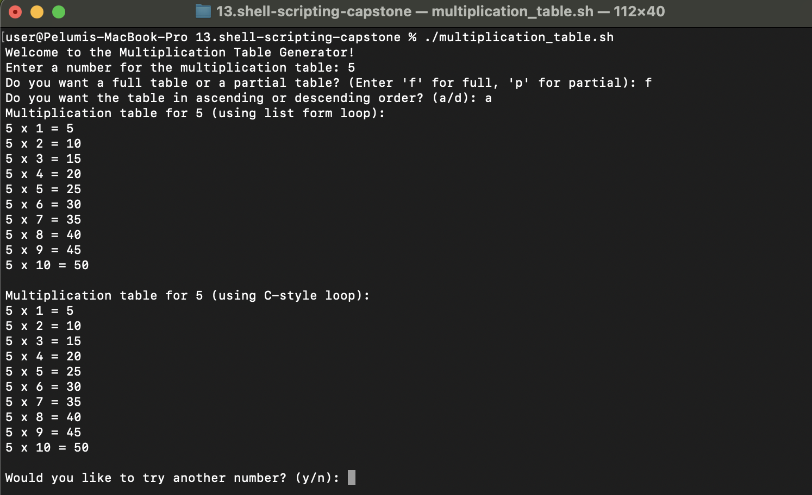
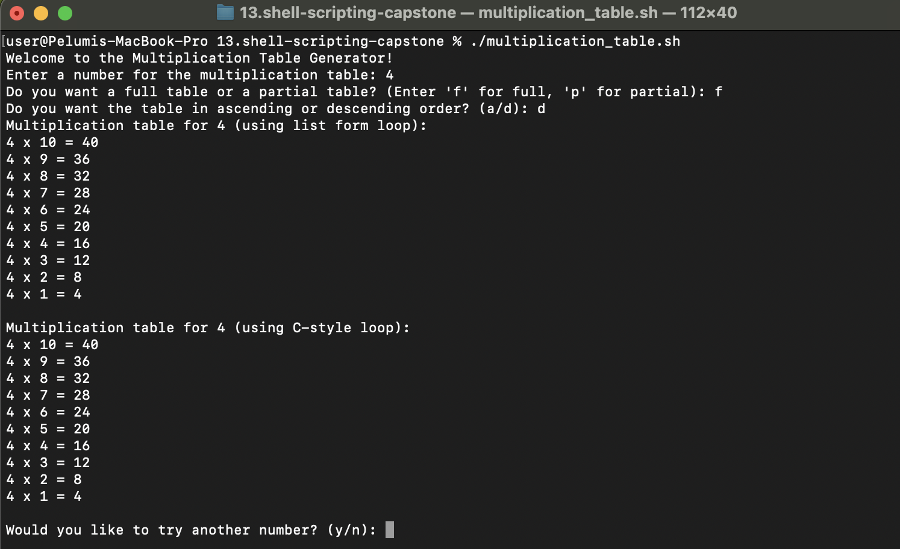
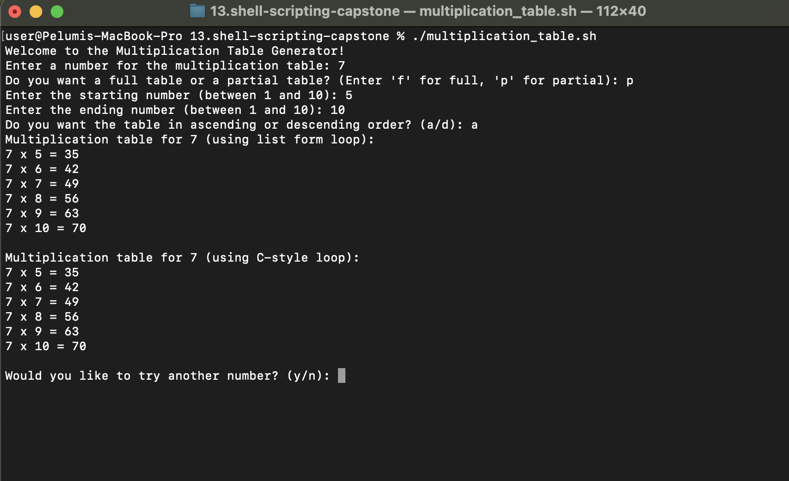
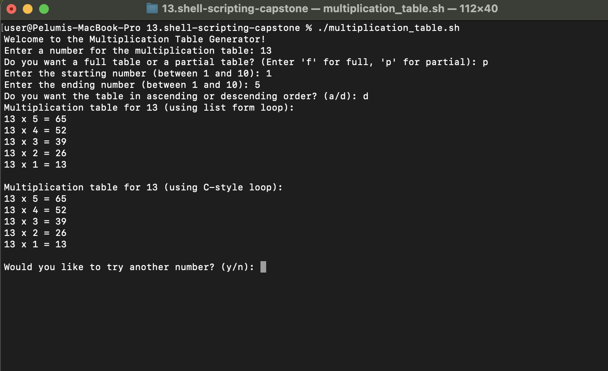
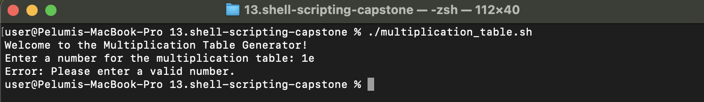
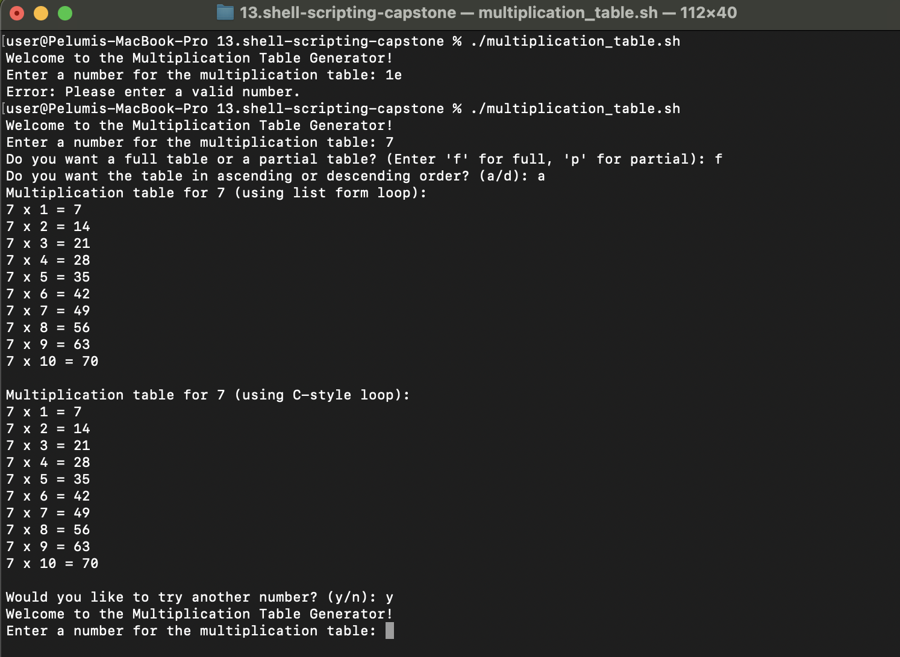

# Capstone Project - Linux Shell Scripting

## Bash Script For Generating a Multiplication Table

### Objective:

Create a Bash script that generates a multiplication table for a number entered by the user. This project will help you practice using loops, handling user input, and applying conditional logic in Bash scripting.

### Project Description

Your script should prompt the user to enter a number and then ask if they prefer to see a full multiplication table from `1 to 10` or a partial table within a specified range. Based on the user's choice, the script will display the corresponding multiplication table.

### Project Requirements

- **User Input for Number**: The script must first ask the user to input a number for which the multiplication table will be generated.
- **Choice of Table Range**: Next, ask the user if they want a full multiplication table (1 to 10) or a partial table. If they choose partial, prompt them for the start and end of the range.
- **Use of Loops**: Implement the logic to generate the multiplication table using loops. You may use either the list form or C-style for loop based on what's appropriate.
- **Conditional Logic**: Use if-else statements to handle the logic based on the user's choices (full vs. partial table and valid range input).
- **Input Validation**: Ensure that the user enters valid numbers for the multiplication table and the specified range. Provide feedback for invalid inputs and default to a full table if the range is incorrect.
- **Readable Output**: Display the multiplication table in a clear and readable format, adhering to the user's choice of range.
- **Comments and Code Quality**: The script should be well-commented, explaining the purpose of different sections and any important variables or logic used.

### Example Script Flow:

1. Prompt the user to enter a number for the multiplication table.

```bash
read -p "Enter a number for the multiplication table: " number
```

2. Ask if they want a full table or a partial table. include Choice validation
   - If partial, prompt for the start and end numbers of the range.

```bash
While true; do
    read -p "Do you want a full table or a partial table? (Enter 'f' for full, 'p' for partial): " choice
    case $choice in
        [Ff])
            start=1
            end=10
            break
            ;;
        [Pp])
            while true; do
                read -p "Enter the starting number (between 1 and 10): " start
                read -p "Enter the ending number (between 1 and 10): " end

                if validate_number "$start" && validate_number "$end"; then
                    if validate_range "$start" "$end"; then
                        break
                    else
                        echo "Using full table instead."
                        start=1
                        end=10
                        break
                    fi
                fi
            done
            break
            ;;
        *)
            echo "Invalid choice. Please enter 'f' for full or 'p' for partial."
            ;;
    esac
done

```

3. Validate the range inputs and handle invalid or out-of-bound entries.

```bash
# Function to validate range
validate_range() {
    local start=$1
    local end=$2

    if [[ $start -gt $end ]]; then
        echo "Invalid range. Start number cannot be greater than end number."
        return 1
    fi

    if [[ $start -lt 1 || $end -gt 10 ]]; then
        echo "Invalid range. Numbers must be between 1 and 10."
        return 1
    fi

    return 0
}
```

4. Generate and display the multiplication table according to the specified range.

```bash
# # Ask for table type
while true; do
    read -p "Do you want a full table or a partial table? (Enter 'f' for full, 'p' for partial): " choice
    case $choice in
        [Ff])
            start=1
            end=10
            break
            ;;
        [Pp])
            while true; do
                read -p "Enter the starting number (between 1 and 10): " start
                read -p "Enter the ending number (between 1 and 10): " end

                if validate_number "$start" && validate_number "$end"; then
                    if validate_range "$start" "$end"; then
                        break
                    else
                        echo "Using full table instead."
                        start=1
                        end=10
                        break
                    fi
                fi
            done
            break
            ;;
        *)
            echo "Invalid choice. Please enter 'f' for full or 'p' for partial."
            ;;
    esac
done
```

5. Provide clear output formatting for ease of reading.

```bash
Multiplication table for 7 (using list form loop):
7 x 1 = 7
7 x 2 = 14
7 x 3 = 21
7 x 4 = 28
7 x 5 = 35
7 x 6 = 42
7 x 7 = 49
7 x 8 = 56
7 x 9 = 63
7 x 10 = 70
```

6. Enhanced User Interaction: Incorporate additional checks or features, like repeating the program for another number without restarting the script.

```bash
# Ask if user wants to try another number
while true; do
    read -p "Would you like to try another number? (y/n): " again
    case $again in
        [Yy])
            exec $0
            ;;
        [Nn])
            echo "Thank you for using the Multiplication Table Generator!"
            exit 0
            ;;
        *)
            echo "Invalid choice. Please enter 'y' for yes or 'n' for no."
            ;;
    esac
done
```

7. Bonus: Ask the user if they want to see the table in ascending or descending order, and implement this feature using if-else statements combined with your loop of choice.

```bash

# Ask for table order
while true; do
    read -p "Do you want the table in ascending or descending order? (a/d): " order

    if [[ $order == "a" ]]; then
        print_table_list_form $number $start $end
        print_table_c_style $number $start $end
        break
    elif [[ $order == "d" ]]; then
        print_table_list_form $number $end $start
        print_table_c_style $number $end $start
        break
    else
        echo "Invalid choice. Please enter 'a' for ascending or 'd' for descending."
    fi
done
```

8. For loop styles
   - List form for loop

```bash
# Function to print multiplication table using list form loop
print_table_list_form() {
    local number=$1
    local start=$2
    local end=$3

    echo "Multiplication table for $number (using list form loop):"
    if [[ $start -gt $end ]]; then
        # Handle descending order with seq
        for i in $(seq $start -1 $end); do
            result=$((number * i))
            echo "$number x $i = $result"
        done
    else
        # Handle ascending order
        for i in $(seq $start $end); do
            result=$((number * i))
            echo "$number x $i = $result"
        done
    fi
    echo
}
```

- C-syle for loop

```bash
# Function to print multiplication table using C-style loop
print_table_c_style() {
    local number=$1
    local start=$2
    local end=$3

    echo "Multiplication table for $number (using C-style loop):"
    if [[ $start -gt $end ]]; then
        # Handle descending order
        for ((i=start; i>=end; i--)); do
            result=$((number * i))
            echo "$number x $i = $result"
        done
    else
        # Handle ascending order
        for ((i=start; i<=end; i++)); do
            result=$((number * i))
            echo "$number x $i = $result"
        done
    fi
    echo
}
```

### Completed script

Putting it all together - [Multiplication table script](./multiplication_table.sh)

```bash
#!/bin/bash

# Function to validate number input
validate_number() {
    if [[ ! $1 =~ ^[0-9]+$ ]]; then
        echo "Error: Please enter a valid number."
        exit 1
    fi
}

# Function to validate range
validate_range() {
    local start=$1
    local end=$2

    if [[ $start -gt $end ]]; then
        echo "Invalid range. Start number cannot be greater than end number."
        return 1
    fi

    if [[ $start -lt 1 || $end -gt 10 ]]; then
        echo "Invalid range. Numbers must be between 1 and 10."
        return 1
    fi

    return 0
}

# Function to print multiplication table using list form loop
print_table_list_form() {
    local number=$1
    local start=$2
    local end=$3

    echo "Multiplication table for $number (using list form loop):"
    if [[ $start -gt $end ]]; then
        # Handle descending order with seq
        for i in $(seq $start -1 $end); do
            result=$((number * i))
            echo "$number x $i = $result"
        done
    else
        # Handle ascending order
        for i in $(seq $start $end); do
            result=$((number * i))
            echo "$number x $i = $result"
        done
    fi
    echo
}

# Function to print multiplication table using C-style loop
print_table_c_style() {
    local number=$1
    local start=$2
    local end=$3

    echo "Multiplication table for $number (using C-style loop):"
    if [[ $start -gt $end ]]; then
        # Handle descending order
        for ((i=start; i>=end; i--)); do
            result=$((number * i))
            echo "$number x $i = $result"
        done
    else
        # Handle ascending order
        for ((i=start; i<=end; i++)); do
            result=$((number * i))
            echo "$number x $i = $result"
        done
    fi
    echo
}

# Main script starts here
echo "Welcome to the Multiplication Table Generator!"

# Get the number from user
while true; do
    read -p "Enter a number for the multiplication table: " number
    if validate_number "$number"; then
        break
    fi
done

# # Ask for table type
while true; do
    read -p "Do you want a full table or a partial table? (Enter 'f' for full, 'p' for partial): " choice
    case $choice in
        [Ff])
            start=1
            end=10
            break
            ;;
        [Pp])
            while true; do
                read -p "Enter the starting number (between 1 and 10): " start
                read -p "Enter the ending number (between 1 and 10): " end

                if validate_number "$start" && validate_number "$end"; then
                    if validate_range "$start" "$end"; then
                        break
                    else
                        echo "Using full table instead."
                        start=1
                        end=10
                        break
                    fi
                fi
            done
            break
            ;;
        *)
            echo "Invalid choice. Please enter 'f' for full or 'p' for partial."
            ;;
    esac
done


# Ask for table order
while true; do
    read -p "Do you want the table in ascending or descending order? (a/d): " order

    if [[ $order == "a" ]]; then
        print_table_list_form $number $start $end
        print_table_c_style $number $start $end
        break
    elif [[ $order == "d" ]]; then
        print_table_list_form $number $end $start
        print_table_c_style $number $end $start
        break
    else
        echo "Invalid choice. Please enter 'a' for ascending or 'd' for descending."
    fi
done

# Ask if user wants to try another number
while true; do
    read -p "Would you like to try another number? (y/n): " again
    case $again in
        [Yy])
            exec $0
            ;;
        [Nn])
            echo "Thank you for using the Multiplication Table Generator!"
            exit 0
            ;;
        *)
            echo "Invalid choice. Please enter 'y' for yes or 'n' for no."
            ;;
    esac
done
```

### Running the Script

1. Make the script executable:

   ```bash
   chmod +x multiplication_table.sh
   ```

2. Run the script:
   ```bash
   ./multiplication_table.sh
   ```

### Usage Examples

1. **Full Table, Ascending Order**



2. **Full Table, Descending Order**



3. **Partial Table, Ascending Order**



4. **Partial Table, Descending Order**



5. I**nvalid Input Handling**



6. **Repeat Program**



## Learning Summary

This project provided hands-on experience with essential Bash scripting concepts. By building an interactive multiplication table generator, you learned how to:

- Use variables to capture and manipulate user input, making your scripts dynamic and responsive.
- Implement both list form and C-style for loops, understanding their syntax, differences, and practical applications in automating repetitive tasks.
- Apply loops to efficiently generate structured output, reinforcing the value of iteration in scripting.
- Enhance user experience by incorporating input validation, conditional logic (including if-else statements), and clear, readable output formatting.

Overall, this project strengthened your ability to write robust, user-friendly Bash scripts that automate tasks and interact effectively with users.
