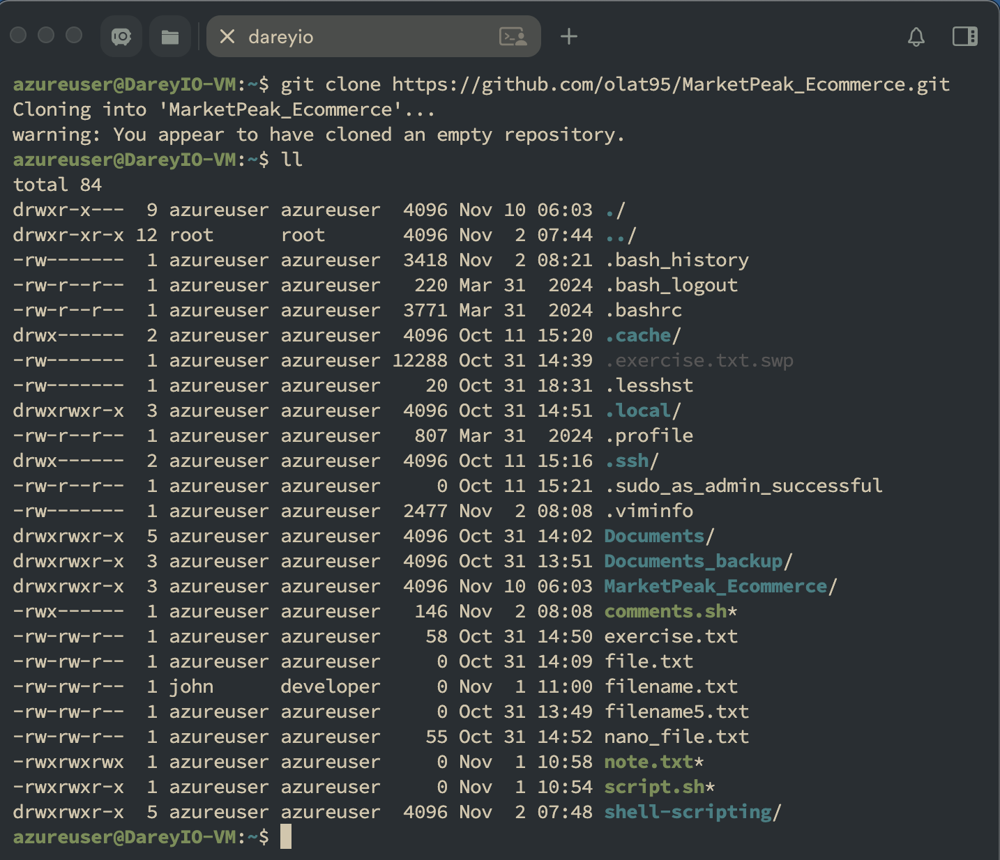
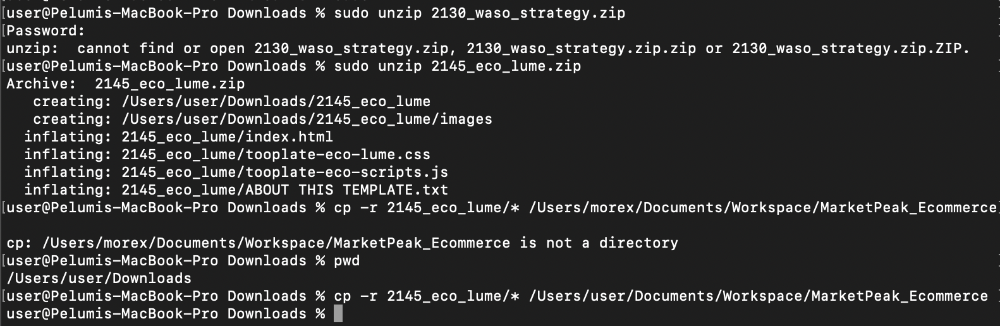
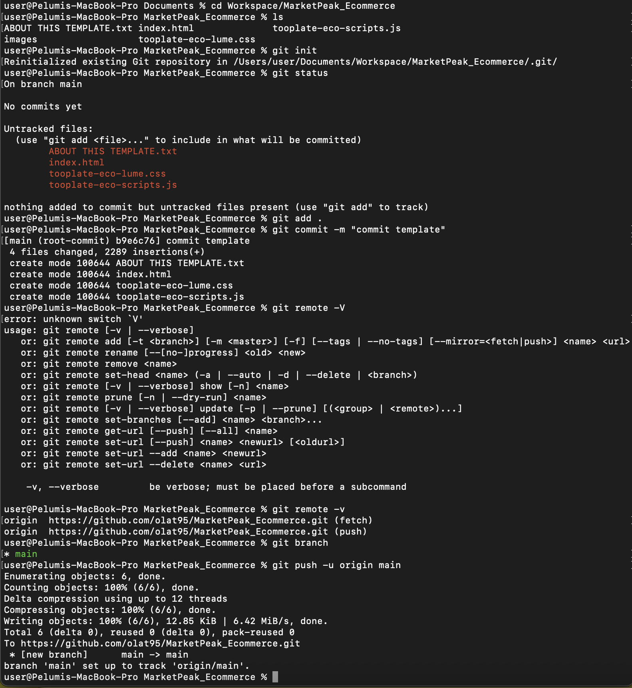
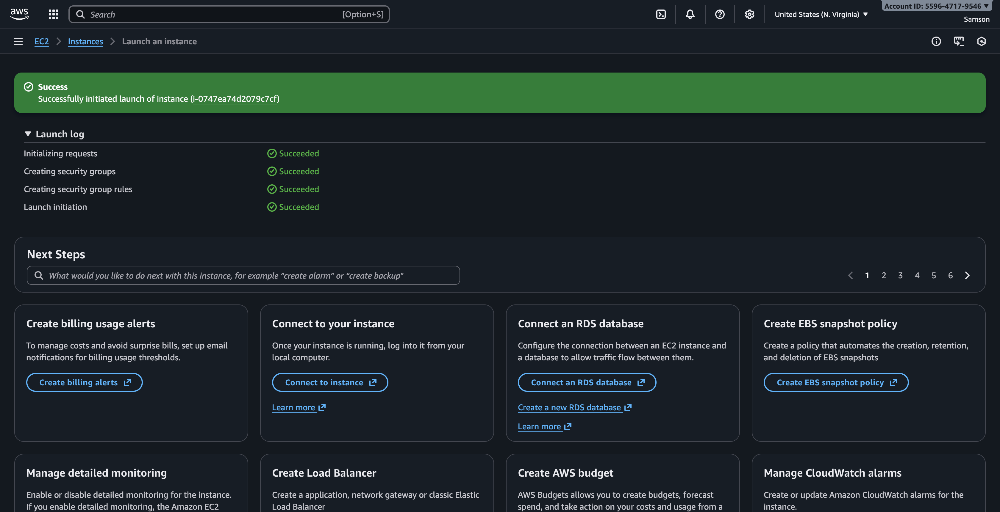
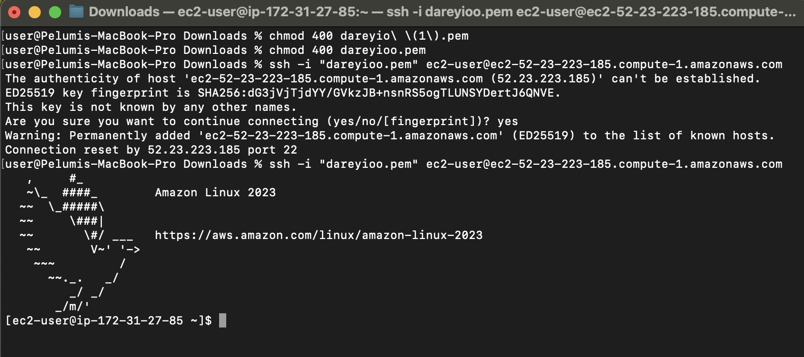
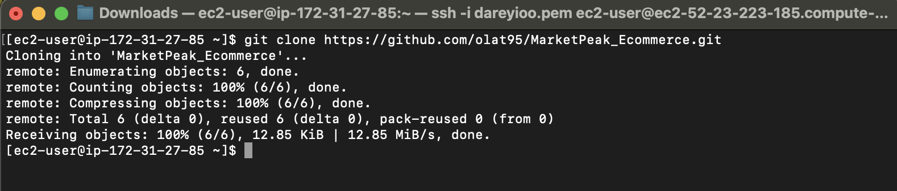
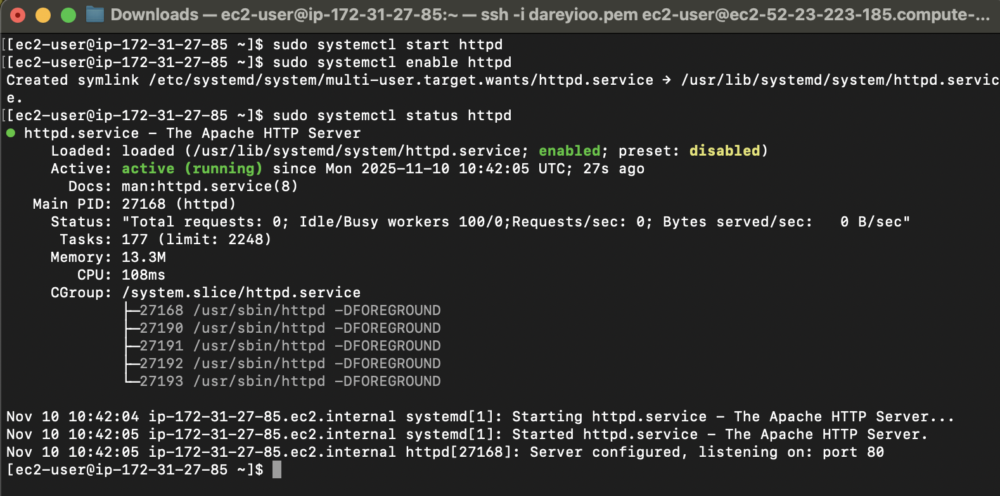
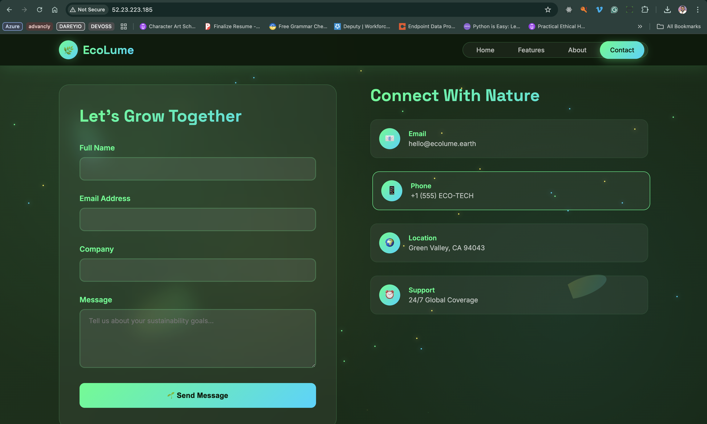
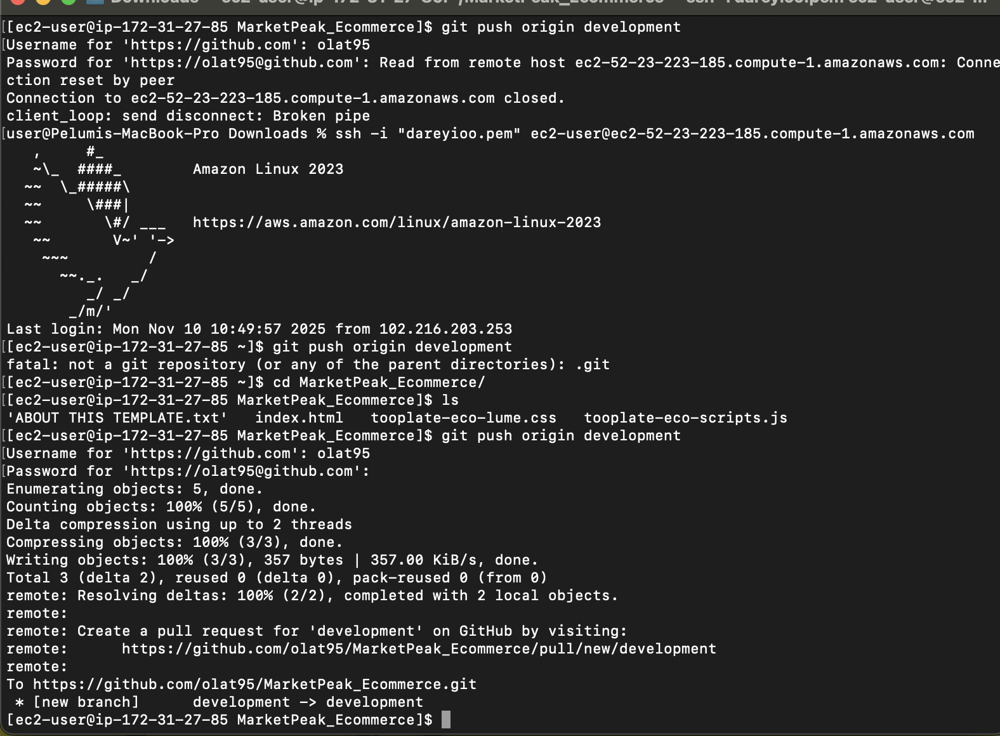
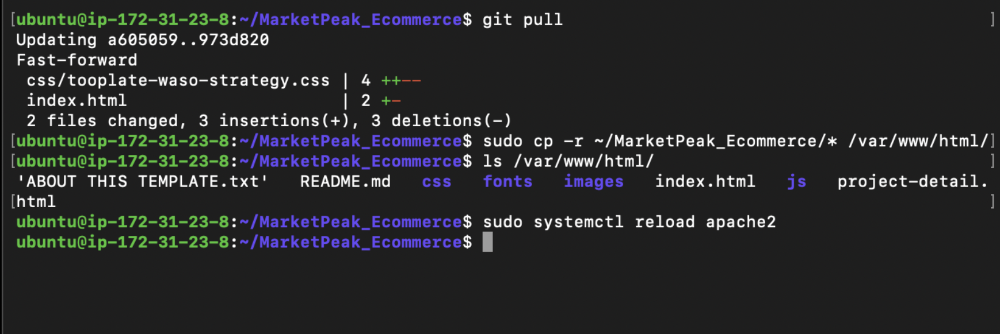

# Capstone Project: E-Commerce Platform Deployment with Git, Linux, and AWS

## Scenario

You have been assigned to develop an e-commerce website for a new online marketplace named "MarketPeak." This platform will feature product listings, a shopping cart, and user authentication. Your objective is to utilize Git for version control, develop the platform in a Linux environment, and deploy it on an AWS EC2 instance. You can find a suitable website template here to kickstart your development

## Tasks

### Task 1 - Implement Version Control with Git

1. Create Git repository on github
2. clone the repository locally
3. cd into the folder



4. Download a Website Template: Visit [Tooplate](https://www.tooplate.com/) or any other free template resource, and download a suitable e-commerce website template. Look for templates that are ready to use and require minimal adjustments.

5. Extract the downloaded template and move into your project directory, `MarketPeak_Ecommerce`.
   - Customize the Template (Optional): If desired and you have basic web development skills, you can make minor customizations to the template to tailor it to `MarketPeak`. This might include updating logos, changing color schemes, or modifying text to better fit the marketplace's brand identity.

```bash
unzip 2130_waso_strategy.zip # unzip the archive
cp -r 2130_waso_strategy/* /Users/morex/Documents/Workspace/MarketPeak_Ecommerce # move the contents to local repository
```



6. Stage, Commit and push the Template to Git

```bash
git add .
git commit -m "commit template"
git push
```



We have successfully implemented version contrrol with the webite code and store it in a remote repository to ensure it is accessible anywhere

---

### Task 2 AWS Deployment

To deploy `MarketPeak_Ecommerce` platform, we'll start by creating an Amazon EC2 instance:

1. Log in to the AWS Management Console.
2. Launch an EC2 instance using an Ubuntu Linux AMI and download the private key
   
3. Ensure the security group has inbound rules on port 22 for ssh access and port 80 for accessing the website

4. Connect to the instance using SSH.

```bash
chmod 400 "linux.pem"
ssh -i "linux.pem" ec2-user@ec2-52-90-228-237.compute-1.amazonaws.com
# ensure you are in the directory where the key was downloaded or reference the path in your command
```



5. Clone the repository on the Linux Server -`git clone https://github.com/mmuyideen/MarketPeak_Ecommerce.git`



6. Install a Web Server on EC2
   Apache HTTP Server or httpd is a widely used web server that serves HTML files and content over the internet. Installing it on Linux EC2 server allows us to host MarketPeak E-commerce site:

```bash
sudo apt update -y              # Update all system packages to the latest versions
sudo apt install apache2 -y       # Install Apache web server (httpd is the package name on Amazon Linux)
sudo systemctl start apache2      # Start the Apache service
sudo systemctl enable apache2     # Enable Apache to start automatically on boot
sudo systemctl status apache2     # Check the current status of the Apache service
```



> 💡 Note: On Amazon Linux, the Apache package is called httpd, not apache2

7. Configure Apache for Website:

   - To serve the website from the EC2 instance, configure Apache to point to the directory on the Linux server where the website code files are stored. Usually in `/var/www/html.`

   - Prepare the Web Directory: Clear the default apache2 web directory and copy MarketPeak Ecommerce website files to it.

   - The directory `/var/www/html/ `is a standard directory structure on Linux systems that host web content, particularly for the Apache HTTP Server. When you install Apache on a Linux system, the installation process automatically creates this directory. It's designated as the default document root in Apache's configuration, meaning that Apache is set up to serve web files (such as HTML, CSS, and JavaScript files) located in this directory to visitors of your website.

   - Reload https: Apply the changes by reloading the httpa service.

   - Optionally check the status of the service again

```bash
sudo rm -rf /var/www/html/*
sudo cp -r ~/MarketPeak_Ecommerce/* /var/www/html/
sudo systemctl reload apache2
sudo systemctl status apache2
```


8. Access Website from Browser
   With apache2 configured and website files in place, MarketPeak Ecommerce platform is now live on the internet:
   Open a web browser and access the public IP of your EC2 instance on `port 80` to view the deployed website.



We have successfully deployed our website on the linux server runnng in the cloud and can be accessed by from anywhere on the internet.

---

### Task 3 Continuous Integration and Deployment Workflow

To ensure a smooth workflow for developing, testing, and deploying our e-commerce platform, follow this structured approach. It covers making changes in a development environment, utilizing version control with Git, and deploying updates to your production server on AWS.

1. Developing New Features and Fixes
   - Create a Development Branch: Begin your development work by creating a separate branch. This isolates new features and bug fixes from the stable version of your website.
   - Implement Changes: On the development branch, add your new features or bug fixes. This might include updating web pages, adding new products, or fixing known issues.

```bash
git branch development
git checkout development

#OR

git checkout -b development
```

2. Version Control with Git

   - Stage Your Changes: After making your changes, add them to the staging area in Git. This prepares the changes for a commit with `git add .`

   - Commit Your Changes: Securely save your changes in the Git repository with a commit. Include a descriptive message about the updates.`git commit -m "Add new features or fix bugs"`

   - Push Changes to GitHub: Upload your development branch with the new changes to GitHub. This enables collaboration and version tracking. `git push origin development`



3. Pull Requests and Merging to the Main branch

   - Create a Pull Request (PR): On GitHub, create a pull request to merge the development branch into the main branch. This process is crucial for code review and maintaining code quality.

   - Review and Merge the PR: Review the changes for any potential issues. Once satisfied, merge the pull request into the main branch, incorporating the new features or fixes into the production codebase.

   - Push the Merged Changes to GitHub: Ensure that your local main branch, now containing the updates, is pushed to the remote repository on GitHub.

```bash
git checkout main
git merge development`
git push origin main
```


4. Deploying Updates to the Production Server

   - Pull the Latest Changes on the Server: SSH into your AWS EC2 instance where the production website is hosted. Navigate to the website's directory and pull the latest changes from the main branch.

   - Update the `/var/www/html/` directory with the new changes

   - Restart the Web Server (if necessary): Depending on the nature of the updates, you may need to restart the web server to apply the changes.

```bash
git pull origin main
sudo cp -r ~/MarketPeak_Ecommerce/* /var/www/html/
sudo systemctl reload apache2
```



5. Testing the New Changes
   - Access the Website: Open a web browser and navigate to the public IP address of your EC2 instance. Test the new features or fixes to ensure they work as expected in the live environment.


We have successfully updated the server with changes on the website.

---

This workflow emphasizes best practices in software development and deployment, including branch management, code review through pull requests, and continuous integration/deployment strategies. By following these steps, you maintain a stable and up-to-date production environment for your e-commerce platform.
